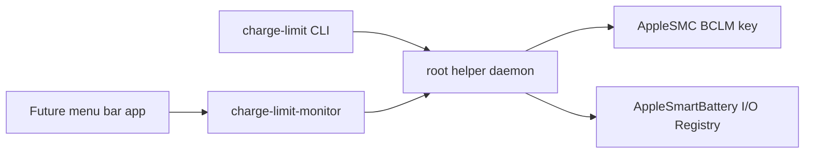

# charge-limit-helper

An open-source Intel MacBook charge limiter MVP.

This project implements the core behavior behind a simple AlDente-like charge
limit on Intel MacBooks:

- `BCLM=100` allows charging.
- `BCLM=15` pauses charging after the target UI battery percentage is reached.
- A user-space monitor decides when to switch between those two states.
- A root helper daemon performs the actual AppleSMC write.
- A development menu bar executable provides a first UI scaffold.

The project is intentionally split into small pieces so it can grow into a
proper menu bar macOS app later.

## Current Status

Validated on:

- MacBook Pro 16-inch 2019, `MacBookPro16,1`
- Intel CPU, AppleSMC-backed battery controller
- macOS 26.5.1

Known current limitations:

- Intel MacBooks only.
- The helper daemon uses a local Unix socket for the MVP.
- The current DMG is a development package with ad-hoc signing. Broad
  distribution still needs Developer ID signing, notarization, and a proper
  ServiceManagement helper installation flow.
- This is low-level battery firmware control. Use at your own risk.

## Build

```sh
swift build -c release
.build/release/charge-limit self-test
```

Build the menu bar app bundle:

```sh
./scripts/build-app.sh
```

Create a DMG:

```sh
./scripts/package-dmg.sh
```

Tagged pushes create GitHub Release assets through `.github/workflows/build.yml`.

## Local Commands

Read local battery and SMC state without the helper:

```sh
.build/release/charge-limit doctor
.build/release/charge-limit self-test
```

Run the helper directly for development:

```sh
sudo .build/release/charge-limit-helperd --daemon
```

In another terminal:

```sh
.build/release/charge-limit status
.build/release/charge-limit resume
.build/release/charge-limit pause
.build/release/charge-limit restore-default
.build/release/charge-limit logs
```

Run the monitor with an 82% target:

```sh
.build/release/charge-limit-monitor --target 82 --verbose
```

Run the development menu bar scaffold:

```sh
.build/release/charge-limit-menubar
```

Run the packaged app after `build-app.sh`:

```sh
open "build/Charge Limit Helper.app"
```

## Install Helper for Development

```sh
./scripts/install-helper.sh
```

This installs:

- `/Library/PrivilegedHelperTools/charge-limit-helperd`
- `/Library/LaunchDaemons/com.lookslikecode.ChargeLimitHelper.plist`
- `/var/run/charge-limit-helper.sock`

Remove it with:

```sh
./scripts/uninstall-helper.sh
```

Install helper and a user LaunchAgent monitor for development:

```sh
./scripts/install-helper.sh --with-monitor --target 82
```

## Architecture



## Roadmap

- Build a SwiftUI menu bar app.
- Add a secure ServiceManagement installer for the helper.
- Replace the MVP socket authorization with code-signature-validated XPC.
- Add settings storage, launch-at-login, and live status UI.
- Add hardware compatibility reporting for Intel MacBook models.

## References

- Apple ServiceManagement `SMAppService`: https://developer.apple.com/documentation/servicemanagement/smappservice
- Apple `SMJobBless`: https://developer.apple.com/documentation/servicemanagement/smjobbless%28_%3A_%3A_%3A_%3A%29
- Apple IOKit: https://developer.apple.com/documentation/iokit
- bclm: https://github.com/zackelia/bclm

## License

MIT. See `LICENSE` and `NOTICE`.
