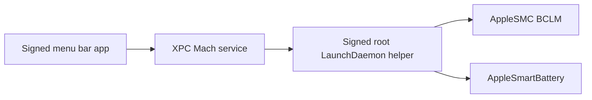

# Production IPC Plan

The current MVP uses JSON over a root-owned Unix socket. That is useful for
development but not the final security model.

Apple's current direction for helper executables is:

- Use `SMAppService` on macOS 13 and later to register helper services from an
  app bundle.
- Use XPC for app-to-helper communication.
- For privileged helper compatibility with older patterns, `SMJobBless` remains
  relevant, but the final implementation should prefer modern ServiceManagement
  where possible.

References:

- https://developer.apple.com/documentation/servicemanagement/smappservice
- https://developer.apple.com/documentation/xpc
- https://developer.apple.com/documentation/servicemanagement/smjobbless%28_%3A_%3A_%3A_%3A%29

## Intended Final Shape

## API Surface

Keep the privileged API small:

- `status`
  - Reads battery state.
  - Reads current `BCLM`.
  - Returns compatibility report.

- `setBCLM(value)`
  - Accepts only `15` or `100` in normal mode.
  - Refuses unsupported machines.
  - Rate-limits different-value writes.

- `restoreDefault`
  - Writes `BCLM=100`.

Avoid adding general shell execution or arbitrary file operations to the helper.

## Client Validation

The helper must reject unrelated clients.

Recommended checks:

- Client has the same Team ID as the app/helper.
- Client designated requirement matches the release app.
- Debug builds may allow a separate development requirement.

The MVP `ChargeLimitServicing` protocol and `SocketChargeLimitService` type are
intended as a seam for replacing the transport with `XPCChargeLimitService`
without rewriting policy or UI code.

## Open Questions

Need confirmation before production implementation:

- Apple Developer Team ID.
- Final app bundle identifier.
- Final helper bundle identifier / launchd label.
- Whether macOS 13 is the minimum supported version.
- Whether to support legacy `SMJobBless` install for older macOS releases.

Until those are decided, the repository should keep Unix socket support for
development and hardware validation only.
